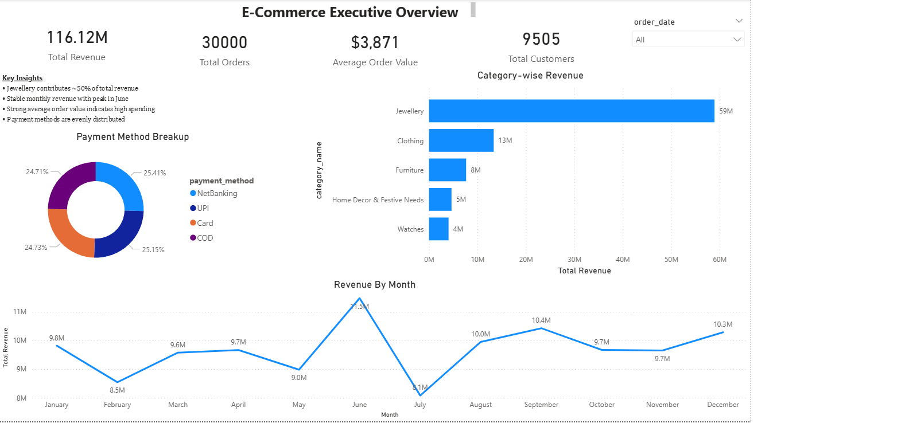
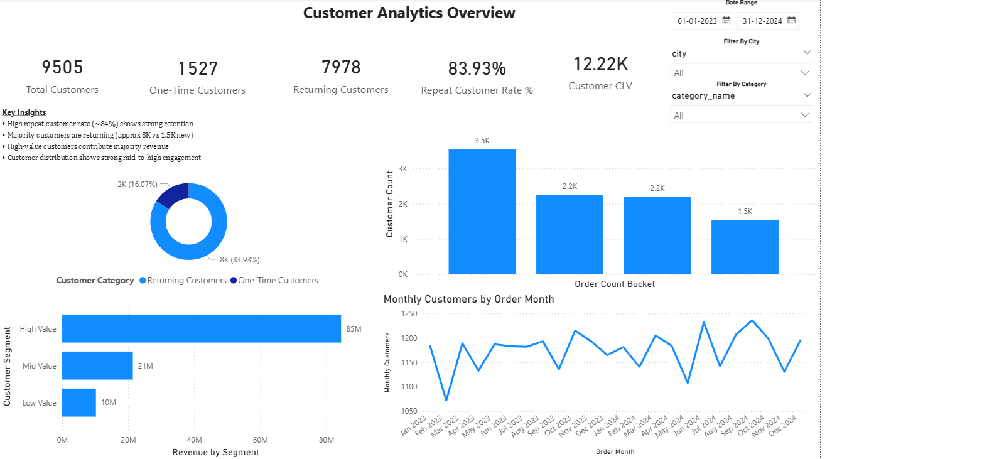
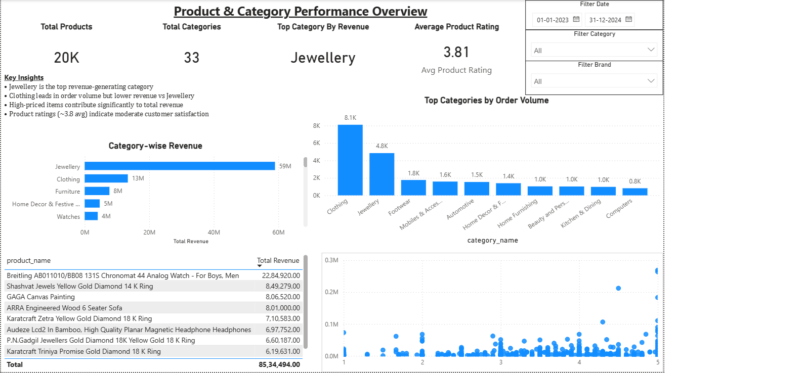

# E-Commerce Analytics Dashboard (Power BI)

## Overview

This project showcases an interactive Power BI dashboard analyzing e-commerce performance across revenue, customers, and product categories.

---

## Dashboard Pages

### Executive Overview

* Total Revenue: 116M+
* Orders: 30K+
* Focus on revenue trends and category performance

---

### Customer Analysis

* Repeat Customer Rate: ~84%
* Customer segmentation (High, Mid, Low value)
* Customer Lifetime Value insights

---

### Product & Category Performance

* Jewellery is the top-performing category
* Category-wise revenue and order volume
* Product-level insights

---

## Key Insights

* Jewellery contributes the highest share of revenue
* Strong repeat customer base indicates high retention
* High-value customers drive majority revenue
* Revenue shows seasonal fluctuations

---

## Tools Used

* Power BI
* Data Cleaning & Transformation
* Data Visualization

---

## Files Included

* `.pbix` file (full dashboard)
* Dashboard screenshots for preview
